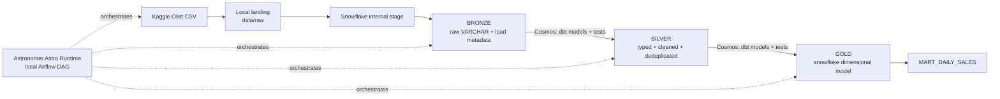
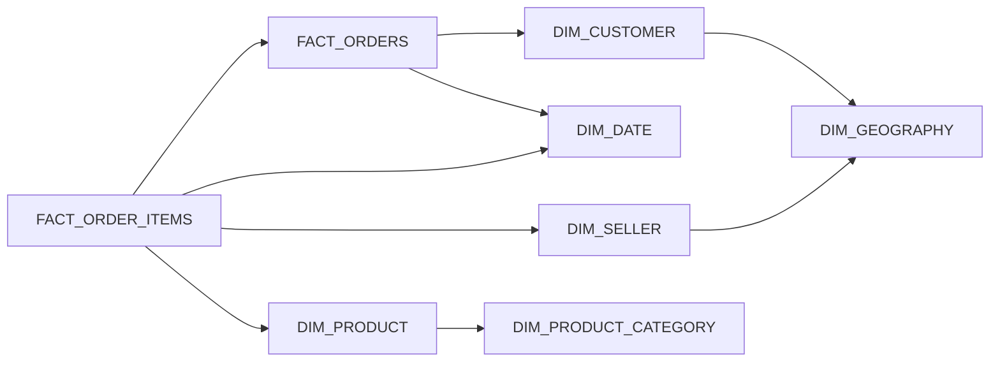

# Olist Medallion: Snowflake + dbt + Astronomer Airflow + Cosmos

Учебный data engineering проект загружает публичный ecommerce-датасет Olist в удалённый Snowflake и проводит его через Bronze, Silver и Gold под управлением локального Airflow в Astronomer Astro Runtime.

## Архитектура



Весь путь выполняет DAG `olist_medallion`:

1. Скачивает публичный архив Olist или использует уже существующие CSV.
2. Проверяет наличие девяти файлов, заголовки и непустые данные.
3. Делает идемпотентный full refresh Bronze через `PUT` и `COPY INTO`.
4. Проверяет Bronze source tests и freshness источников.
5. Astronomer Cosmos разворачивает 18 dbt-моделей Silver/Gold и их тесты в отдельные Airflow-задачи.
6. Выполняет модели параллельно по dbt dependency graph и отдельно показывает relationship-тесты с несколькими родителями.

В текущем графе 52 Airflow-задачи: пять ingestion/quality steps и 47 Cosmos tasks. Для каждой dbt-модели видны собственные run/test status и logs; упавшую модель можно перезапустить отдельно.

Расписание по умолчанию отсутствует, поэтому DAG не включает платный Snowflake warehouse без ручного запуска. Его можно задать через `OLIST_DAG_SCHEDULE`.

## Snowflake-модель Gold



Это именно схема «снежинка»: категория вынесена из product dimension, а география — из customer/seller dimensions. `FACT_ORDERS` имеет гранулярность «один заказ», `FACT_ORDER_ITEMS` — «одна позиция заказа».

## Основной запуск: Astronomer на Windows / PowerShell

Требования: Docker Desktop, Astro CLI, удалённый аккаунт Snowflake и минимум 4 ГБ памяти для Docker (лучше 8 ГБ). Проект уже инициализирован под Astro, поэтому `astro dev init` запускать не нужно.

1. Проверьте Astro CLI. На этой рабочей машине уже установлен `1.45.0`; для новой машины используйте:

   ```powershell
   winget install -e --id Astronomer.Astro
   astro version
   ```

   Если `winget` отсутствует, скачайте Windows AMD64 `.exe` из [официальных Astro CLI Releases](https://github.com/astronomer/astro-cli/releases/latest), переименуйте его в `astro.exe` и добавьте каталог в пользовательский `PATH`.

2. Откройте [.env](./.env) и заполните:

   - `SNOWFLAKE_ACCOUNT` — account identifier без `.snowflakecomputing.com`, предпочтительно в формате `organization-account`;
   - `SNOWFLAKE_USER` и `SNOWFLAKE_PASSWORD`; для service user в `SNOWFLAKE_PASSWORD` передаётся PAT;
   - при необходимости `SNOWFLAKE_ROLE`, `SNOWFLAKE_WAREHOUSE`, `SNOWFLAKE_DATABASE`.

3. Для dev-аккаунта с ролью `SYSADMIN` оставьте `SNOWFLAKE_CREATE_RESOURCES=true`. Загрузчик создаст базу и X-Small warehouse с `AUTO_SUSPEND=60`. Если warehouse и база уже управляются отдельно, поставьте `false` и укажите существующие имена.

4. Выберите Docker, проверьте импорт DAG и запустите локальный Astro Runtime:

   ```powershell
   astro config set container.binary docker
   astro dev parse
   astro dev start
   ```

5. Откройте [Airflow UI](http://localhost:8080), войдите как `admin / admin`, включите DAG `olist_medallion` и нажмите Trigger.

Astro CLI собирает образ из `Dockerfile` на Astro Runtime `3.3-2` с Python 3.13, устанавливает `dbt-snowflake` и `astronomer-cosmos` из `requirements.txt` и поднимает локальные компоненты Airflow. Первый запуск скачает около 45 МБ CSV. Если Kaggle API недоступен, скачайте датасет [Brazilian E-Commerce Public Dataset by Olist](https://www.kaggle.com/datasets/olistbr/brazilian-ecommerce) вручную и положите девять CSV в `data/raw/`.

## Резервный запуск без Astro CLI

Для диагностики сохранён отдельный Apache Airflow Compose-стек. Он использует `Dockerfile.apache` и не влияет на основной Astro-образ:

   ```powershell
   docker compose up airflow-init --build
   docker compose up -d
   docker compose ps
   ```

В этом режиме логин Airflow — `airflow / airflow`.

## Нужные права Snowflake

В режиме `SNOWFLAKE_CREATE_RESOURCES=true` роль должна уметь создавать warehouse и database. В режиме `false` ей нужны как минимум:

- `USAGE` на существующие warehouse и database;
- возможность создавать/использовать схемы `BRONZE`, `SILVER`, `GOLD`;
- создание stage, file format и tables в этих схемах;
- `SELECT`, `INSERT`, `TRUNCATE` и `DELETE/CREATE OR REPLACE` для объектов проекта.

Проект использует отдельного service user `OLIST_SERVICE`, роль `OLIST_PIPELINE_ROLE` и PAT с ограничением роли. Для production дополнительно настройте network policy, secrets backend и ротацию PAT либо key-pair authentication.

## Astronomer Cosmos

`DbtTaskGroup` находится внутри основного DAG после Bronze source tests и freshness. Cosmos `1.15.1` использует локально установленный dbt `1.11.6`, существующий `dbt/profiles.yml` и `ExecutionMode.LOCAL`. Парсинг выполняется через `dbt ls`, тесты — в режиме `AFTER_EACH`; relationship-тесты с несколькими родителями отделяются и запускаются только после всех зависимостей.

Cosmos cache отключён для одинакового поведения рабочей Postgres metadata DB и временной SQLite DB в `astro dev pytest`. Для небольшого графа из 18 моделей повторный `dbt ls` приемлем. Телеметрия Cosmos также отключена в `Dockerfile`.

## Слои данных

### Bronze

Таблицы `RAW_*` повторяют CSV один к одному. Бизнес-поля остаются `VARCHAR`, а загрузчик добавляет `_LOAD_ID`, `_SOURCE_FILE`, `_SOURCE_ROW_NUMBER`, `_LOADED_AT`. Таблица `LOAD_AUDIT` хранит число загруженных строк по каждому файлу.

### Silver

Модели `STG_*` приводят даты и числа к типам Snowflake, нормализуют ZIP/state, устраняют повторы и проверяют ключи и допустимые review score.

### Gold

- `DIM_DATE`, `DIM_CUSTOMER`, `DIM_SELLER`, `DIM_GEOGRAPHY`;
- `DIM_PRODUCT`, `DIM_PRODUCT_CATEGORY`;
- `FACT_ORDERS`, `FACT_ORDER_ITEMS`;
- `MART_DAILY_SALES` с дневными KPI.

Примеры аналитических запросов находятся в [sql/sample_queries.sql](./sql/sample_queries.sql).

## Полезные команды

Проверить DAG и unit-тесты в Astro Runtime без запуска всего стека:

```powershell
astro dev parse
astro dev pytest
```

Эти же проверки автоматически запускает GitHub Actions для каждого pull request и после слияния в `master`. Workflow использует только фиктивные CI-переменные: локальный `.env` и Snowflake credentials в репозиторий не передаются.

Типичные production-сбои, способы диагностики, меры защиты и checklist перед деплоем собраны в [Production troubleshooting](./docs/production-troubleshooting.md).

Открыть shell scheduler-контейнера и запустить Airflow/dbt-команды внутри локального Astro Runtime:

```powershell
astro dev bash --scheduler
python /usr/local/airflow/scripts/validate_olist.py
dbt debug --project-dir /usr/local/airflow/dbt
dbt build --project-dir /usr/local/airflow/dbt
exit
```

Посмотреть состояние и остановить Astro:

```powershell
astro dev ps
astro dev logs --scheduler
astro dev stop
```

Для будущего деплоя в Astronomer Cloud выполните `astro login`, создайте Deployment и задайте Snowflake-переменные через Astro Environment Manager или secrets backend. `.env` с паролем в deployment и Git не отправляйте.

Резервные Compose-команды:

```powershell
docker compose run --rm airflow-cli python /opt/airflow/scripts/validate_olist.py
docker compose run --rm airflow-cli dbt debug --project-dir /opt/airflow/dbt
docker compose logs -f airflow-scheduler airflow-dag-processor
docker compose down
```

## Структура проекта

```text
dags/                   Airflow DAG
scripts/                download, validation, Snowflake Bronze loader
dbt/models/silver/      cleaned and typed medallion layer
dbt/models/gold/        snowflake dimensional model and mart
dbt/tests/              business data-quality assertions
tests/                  Astro DAG integrity tests
.github/workflows/      GitHub Actions: Astro DAG parse and pytest
docs/                   production troubleshooting and operational checklists
include/                Astro utility-files directory
sql/                    example analytical queries
data/raw/               local landing zone (ignored by git)
Dockerfile              primary Astro Runtime image
airflow_settings.yaml   local Astro objects (no secrets)
packages.txt            OS packages for Astro Runtime
requirements.txt        pinned Python dependencies, including Cosmos and dbt
docker-compose.yml      fallback Apache Airflow + Postgres
Dockerfile.apache       fallback Apache Airflow image
```

Полезные первичные источники: [локальный запуск Astro](https://www.astronomer.io/docs/astro/cli/run-airflow-locally/), [структура Astro-проекта](https://www.astronomer.io/docs/astro/cli/develop-project/), [Astronomer Cosmos](https://astronomer.github.io/astronomer-cosmos/), [Snowflake local-file loading](https://docs.snowflake.com/en/user-guide/data-load-local-file-system), [dbt Snowflake setup](https://docs.getdbt.com/docs/core/connect-data-platform/snowflake-setup).
